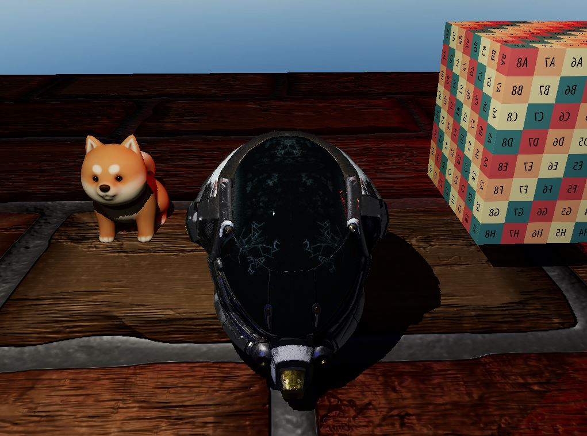

# PBR renderer using Rust and WGPU.

This is an still on-going project only for self learning purposes. 

### Features:
- [x] Skybox
- [x] GLTF scene loading
- [x] Physically based rendering
    - [x] Normal mapping
    - [x] Ambient occlussion map
    - [ ] Emission map
- [x] Point light shadow mapping
    - [ ] Smooth shadow edges
- [x] HDR and gamma correction
- [ ] Diffuse and specular environment map image based lighting

